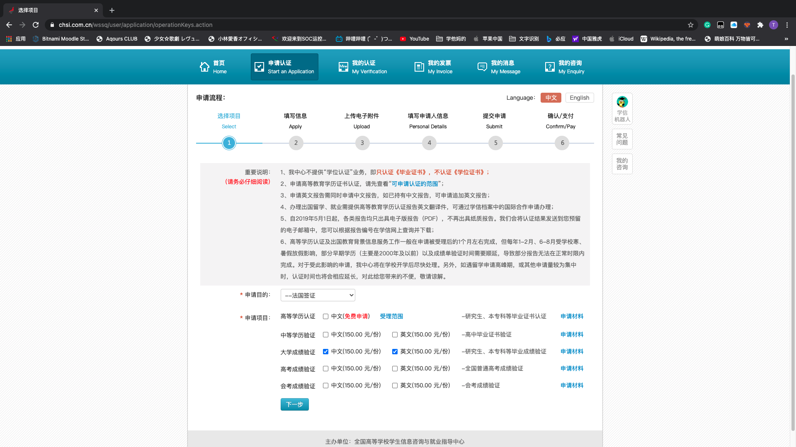

# 学信网成绩认证

## 所需材料

* 交大开具的成绩单
* Etudes en France CN码
* 中英文成绩单扫描件
* 身份证正反面扫描件
* ¥300

## 流程

* 交大成绩单
  * 大三同学可自行前往***新行政楼1楼注册与学务中心***开具成绩证明，或在一门式服务平台（数字交大）申请
  * 大四同学因保研无法自行开具，教务老师会帮忙开好，大家等通知就行。

?> 获得材料：交大出具的中英文成绩单

* [学信网申请](http://www.chsi.com.cn/wssq/)
  * 点击进入网上申请系统，使用学信网账号登录
  * 点击申请认证-新申请
  * 申请目的-法国签证，申请项目-大学成绩验证（中文、英文）

  * 添加-按照要求填写信息（没有的可以不填）

  ?> 档案号填写Etudes en France CN码

  * 填写中文成绩-Excel上传（Excel可以从教务信息网中学生成绩查询中直接导出）  

  ?> 法语专业同学只要一专课程就行，二专不需要

  !> Excel课程顺序要和纸质成绩单一致，否则会被退回

  * 填写英文成绩信息-在线填写点一遍就行
  * 上传电子附件-一专中英文成绩单、身份证正反面
  * 填写申请人信息
  * 提交申请
  *交钱

?> TODO...
